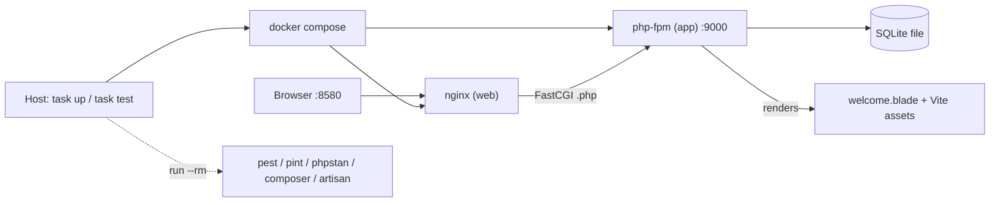

# Slice 001 — Dockerized dev environment + Task runner + Laravel 13 scaffold

> Completed: 2026-06-15
> Commits: 6c621c2..4958e7f (branch slice-001-docker-task-dev-env; + docs(slice) close commit)

## What

An empty repo became a fully containerized, Task-driven Laravel 13 development
environment. `task up` brings up a Laravel 13 app served by nginx→php-fpm (Alpine,
PHP 8.5) at `localhost:8580`, and the whole toolchain (Composer, Artisan, Pest, Pint,
PHPStan, npm/Vite) runs inside containers, invoked from the host via `task` — no local
PHP/Node required. A multi-stage build additionally yields a production target that is
Composer-, dev-dependency- and test-free.

## Why

- Conventional, proven web runtime (php-fpm + nginx) over FrankenPHP/Sail — no dev/prod drift.
- A multi-stage Dockerfile makes the prod image test-/Composer-free without a separate test image.
- Task as the single host orchestrator — Composer/tests run in the container from the first command; the same targets feed CI later.
- Current, lean base images (Alpine 3.24, PHP 8.5, Node 24) chosen after lifecycle review — never oldstable.
- SQLite as a bind-mounted file keeps the dev stack to two services; quality gates wired so `task check` is the pre-commit gate.

## Decisions

- **php-fpm + nginx (two containers)** — conventional and proven; the explicit web/app split. *Why not* FrankenPHP/Sail: Sail is dev-only and causes dev/prod drift; FrankenPHP's single-container simplicity wasn't worth diverging from the conventional stack here.
- **Multi-stage Dockerfile (`base → with-composer → dev`; `build`/`assets → prod`)** — the dev image also runs the tests; the prod image carries no Composer, dev deps or tests. *Why not* a separate test container: the multi-stage split already delivers a test-free prod image.
- **Task (go-task) as the single host orchestrator** — no local PHP/Node; tooling runs in ephemeral containers; same targets reusable by CI.
- **Laravel 13 on PHP 8.5 (latest stable), scaffolded inside the container** — Composer-in-container from the first command. Fallback to PHP 8.4 only if a later dependency (e.g. Filament, Phase 5) lacks clean 8.5 support.
- **Alpine + current LTS/stable base images** — `php:8.5-fpm-alpine`, `nginx:1.30-alpine`, `node:24-alpine`; lifecycles verified live. *Why not* Debian bookworm: it is oldstable (regular support ended 2026-06-10). Node 24 is Active LTS (22 is only Maintenance). Promoted to `rules.md → ## Container & Dev Environment`.
- **Node out of the PHP image** — run as a profiled `node` compose service (Vite); Node is a build tool, not a PHP-runtime concern (also avoids a musl ABI copy hack).
- **Queue worker + scheduler deferred to Phase 4/6** — same prod image, different command; SQLite stays a bind-mounted file (no DB service).

Resolved versions: Laravel 13.15.0 · PHP 8.5.7 · Composer 2.10.1 · Node 24.16.0 · Alpine 3.24 · nginx 1.30 · Pest 4.7 · Larastan 3.10 · Pint 1.27. Image sizes: dev ~225 MB, prod ~260 MB.

## Commits

- `6c621c2` — chore(app): scaffold Laravel 13 with SQLite and quality gates
- `6c37082` — build(docker): containerized dev environment (Alpine, php-fpm + nginx)
- `4958e7f` — build(task): Task runner for the dev workflow
- `docs(slice)` — archive slice-001 + promote container architecture to rules.md

## Follow-ups

> Light / needs-rethinking findings carried over from Phase 8 Review. Candidates for future slices.

- **Prod image hardening (→ Phase 6 Containerization):** run prod as non-root (`USER www-data` + writable `storage`/`bootstrap/cache`); add a php-fpm/nginx healthcheck (web→app readiness); decide on a `restart:` policy.
- **End-to-end smoke (→ consider in a later slice):** the Pest smoke test exercises app boot only, not the real nginx→FastCGI path on `:8580`. A `task`-level `curl` smoke (as in the Test Strategy) would regression-protect the infra path itself.
- **Dev asset workflow doc:** a fresh `task up` without an asset build renders the welcome page unstyled (masked in tests by `withoutVite()`). Document the `task init` / `task dev` flow, or have `up` ensure assets.

## How (Diagram)

