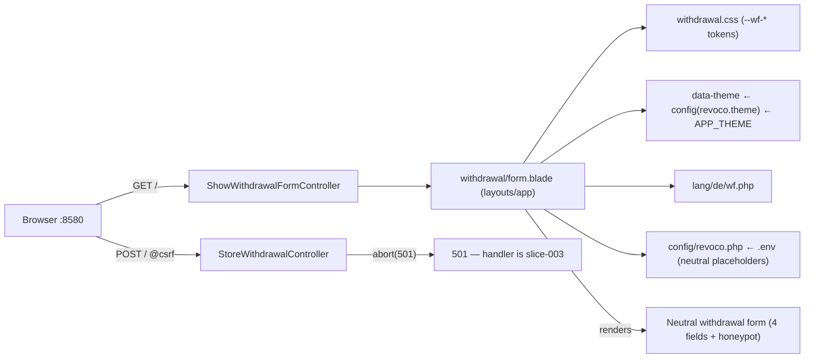

# Slice 002 — Withdrawal form page (neutral, themeable, i18n-ready)

> Completed: 2026-06-15
> Commits: 4de48fe..311044e (branch slice-002-withdrawal-form, built in the main
> checkout without a worktree per operator request; merged --no-ff into main; + docs(slice) close commit)

## What

`GET /` now serves the rendered, neutral-themed § 356a BGB withdrawal form
(render-only). A named route `withdrawal.form` → invokable
`ShowWithdrawalFormController` → `withdrawal/form.blade.php` (extending
`layouts/app`) renders the four prototype fields — `name`*, `email`*,
`orderNumber` (optional), `subject`* — with `@csrf`, ARIA wiring
(label/for/id, `aria-required`, `aria-describedby`), and an off-screen honeypot
(`name="website"`). The form posts to a `withdrawal.store` (`POST /`) stub
(`StoreWithdrawalController`) that returns HTTP 501 until slice-003 fills it.
The `--wf-*` neutral token contract + base form/card styles were ported into
`resources/css/withdrawal.css` (imported by `app.css`), with one commented
`[data-theme="example"]` overlay hook. `data-theme` on the card is resolved
from `config('revoco.theme')` ← `APP_THEME` (neutral default). All user-facing
copy lives in `lang/de/wf.php`; branding (logo/name/imprint/privacy) reads from
`config/revoco.php` ← `.env`, with neutral placeholders mirrored in
`.env.example`. Default locale flipped to `de` (config + env + phpunit). The
obsolete scaffold `welcome.blade.php` was removed and `SmokeTest` updated.

## Why

- Ship the legally-mandated form first — neutral and brand-free — so the public
  OSS repo carries a working form with the theming / i18n / branding seams in
  place but no operator or brand specifics.
- Defer submit (validation, persistence, async mail/push) to slice-003 behind a
  named-route 501 stub, so the form `action` + `@csrf` are structurally complete
  now without half-built submit logic.
- Keep theming as configuration, not a code fork: one `--wf-*` contract switched
  by `data-theme`/`APP_THEME`; brand overlays stay private.

## Decisions

- **Render-only slice; submit deferred to slice-003.** Form posts to the
  `withdrawal.store` 501 stub; slice-003 fills the handler, FormRequest, and
  persistence.
- **Public repo ships the neutral theme + mechanism only.** `data-theme` ←
  `APP_THEME`, the `--wf-*` contract, and one commented `[data-theme="example"]`
  overlay hook. Concrete brand themes / real logos live in the private infra repo
  (the prototype's base64 brand logos were intentionally not ported).
- **Prototype dev-only features dropped.** Language switcher (de/en/fr/it/es
  flags) — i18n is prepared, no switcher at launch; theme-preview buttons —
  production has one theme per deployment.
- **Field set follows the prototype:** `name`* / `email`* / `orderNumber`
  (optional) / `subject`*.
- **Error messages: display deferred, copy normalised to formal "Sie".** The
  prototype's client-side validation JS was dropped; the styled `.wf-error`
  paragraphs ship but are inert (native browser bubbles show in the interim).
  Real inline-error display lands server-side in slice-003. The prototype's
  `subject` message mixed "Sie"/"du"; operator confirmed consistent **"Sie"** —
  the reworded German in `lang/de/wf.php` is the chosen wording.
- **Theming contract promoted to `design/theming.md`.** The stable `--wf-*` token
  list + `data-theme`/`APP_THEME` mechanism + overlay-hook convention are
  cross-cutting (private brand overlays depend on them) → written as design
  knowledge in this slice.
- **Open (→ slice-003):** tension between `rules.md` ("contract identification"
  as a mandatory field) and the prototype (`orderNumber` *optional*, `subject`
  *required*). A validation/legal decision for the slice-003 FormRequest; kept in
  this archive and tracked in the slice-003 plan (not promoted to intent).

## Commits

- `4de48fe` — feat(withdrawal): render neutral § 356a withdrawal form (slice-002)
- `311044e` — Merge slice-002: withdrawal form (neutral, themeable, i18n-ready)
- `docs(slice)` — archive slice-002 + add `design/theming.md`

Gate at close: Pint (33 files) · PHPStan max (no errors) · Pest (7 passed / 19
assertions). Live render verified through nginx→php-fpm on `:8580` (GET / → 200;
POST / → 419 without CSRF token, confirming CSRF active; 501 stub covered by test).

## Follow-ups

> Light / needs-rethinking findings carried over from Phase 8 Review.

- **Inline error display (→ slice-003):** the styled `.wf-error` paragraphs are
  present but inert; the browser's native validation bubbles show in the interim.
  slice-003 wires them server-side (`@error` + `.is-invalid` + `old()`, re-add
  `role="alert"` removed here as premature) sourcing the "Sie" copy.
- **Honeypot AT-hiding (accepted, noted):** hiding relies on `aria-hidden` +
  `tabindex="-1"` + off-screen only — the standard pattern; a honeypot must stay
  submittable. Revisit only if a real-world AT bypass surfaces.

## How (Diagram)

