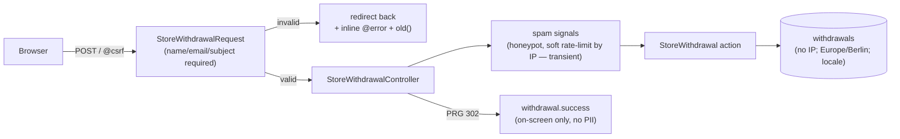

# Slice 003 — Withdrawal submit, persistence & success

> Completed: 2026-06-15
> Commits: 3dd7371..cf590a2 (branch slice-003-withdrawal-submit, built in the main
> checkout without a worktree per operator request; merged --no-ff into main; + docs(slice) close commit)

## What

The withdrawal submit is live. `POST /` (`withdrawal.store`) runs
`StoreWithdrawalRequest` (validates the three mandatory fields — `name`, `email`,
`subject` required; `orderNumber` optional), evaluates non-blocking spam signals,
delegates persistence to a `StoreWithdrawal` action, and PRG-redirects to a new
`withdrawal.success` page (`ShowWithdrawalSuccessController` + `success.blade.php`,
reusing the slice-002 layout/theme). A `withdrawals` table (migration + `Withdrawal`
model) stores `name`, `email`, `order_number` (nullable), `subject`, `locale`,
`spam` (bool), `spam_reason` — and nothing else (no IP). The slice-002 form was
upgraded: `novalidate` + inline `@error` blocks + `.is-invalid` +
`aria-invalid`/`aria-describedby` + `old()` repopulation (the browser's native
validation bubbles are gone), plus a `<main>` landmark on both pages. App timezone
is now `Europe/Berlin` (config + env + phpunit) so `created_at` is consumer-local
time. New German keys: `wf.success.*`, `wf.field.email.invalid`.

## Why

§ 356a stage 2: receive and prove the declaration. The submit must never be
hard-blocked — honeypot and a soft per-IP rate-limit are signals only (`spam=true`
+ reason); every submission is stored and always redirected to success. Validating
the three mandatory fields is lawful collection, not obstruction. The IP is used
only as a transient rate-limit cache key, never persisted (data minimization). The
success page is on-screen confirmation only; the durable acknowledgment e-mail is
slice-004.

## Decisions

- **Mandatory fields resolved (law-grounded), closing the slice-002 open question:**
  `name` / `email` / `subject` required, `order_number` optional — § 356a Abs. 2
  Nr. 1–3; `subject` (free-text goods) is the contract identification. No extra
  mandatory fields. (Kept in archive; rules.md Tabu already covers it.)
- **Spam signals are non-blocking.** Store-all + flag; never reject. Honeypot +
  soft rate-limit set `spam` + reason. **IP not persisted** (transient cache key
  only). The flag is a triage signal (merchant notification / operator backend),
  not an acceptance gate — and per slice-004 it does not gate the consumer
  acknowledgment (always sent, legal-maximum posture).
- **Validation ≠ obstruction; success page = on-screen confirmation only** (no PII
  echo, no reference number; durable proof is the slice-004 e-mail).
- **Timestamp Europe/Berlin; locale captured per row** (drives the slice-004 e-mail
  language).
- **No `handled` field (slice-005 concern), no partial withdrawal** (intent
  Non-Goal — free-text `subject` covers "which goods").
- **Rendering hardened against FOUC:** critical `withdrawal.css` is inlined in the
  layout `<head>` (no external render-blocking stylesheet; Tailwind not loaded on
  these pages), and every inline SVG carries explicit `width`/`height`.
- Compliance grounding promoted: `rules.md` now references
  [`design/legal-compliance.md`](../design/legal-compliance.md) as the § 356a model.

## Commits

- `3dd7371` — feat(withdrawal): implement submit, persistence & success (slice-003)
- `cf590a2` — Merge slice-003: withdrawal submit, persistence & success
- `docs(slice)` — archive slice-003 + reference legal-compliance.md from rules.md

Gate at close: Pint (37 files) · PHPStan max (no errors) · Pest (14 passed / 63
assertions). Live POST + render through nginx verified (valid→302+spam=0;
honeypot→302+spam=1; throttle→302+spam=throttle; CEST timestamps; no-FOUC head).

## Follow-ups

> Light / awareness findings carried over from Phase 8 Review.

- **Rate-limit threshold (→ slice-004):** 5 submits / IP / 60s before the
  `throttle` signal trips. Non-blocking and triage-only, but shared-IP/NAT
  consumers may be flagged. Revisit when slice-004 wires e-mail gating to `spam`
  (current posture: acknowledgment always sent regardless of the flag).
- **Prod image must keep `resources/css/withdrawal.css` (→ slice-006):** it is read
  at render via `resource_path()` for the inlined critical CSS. The lean prod image
  must not strip it.
- **Web font not loaded:** the layout no longer pulls the Vite/Tailwind bundle, so
  Instrument Sans is not loaded; the form uses its own `--wf-font` system stack by
  design. No action needed unless a branded font is wanted later.

## How (Diagram)

