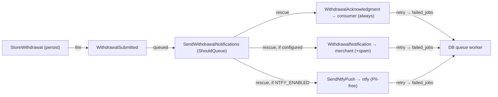

# Slice 004 — E-mails & push (async delivery)

> Completed: 2026-06-16
> Commits: cc3ffa1..41786d8 (branch slice-004-emails-push, built in the main checkout
> without a worktree per operator request; 5 atomic commits merged --no-ff into main;
> + docs(slice) close commit)

## What

Async delivery is live. The slice-003 `StoreWithdrawal` action fires a
`WithdrawalSubmitted` event after persist. An auto-discovered, queued listener
(`SendWithdrawalNotifications`, `ShouldQueue`) fans out three independent channels
off the request, each wrapped in `rescue()` so one failing never blocks the others:

1. **`WithdrawalAcknowledgment`** to the consumer — **always**, even for spam rows,
   rendered in the consumer's locale; § 356a Abs. 4: receipt confirmation +
   declaration content + Europe/Berlin date/time, **no advertising**.
2. **`WithdrawalNotification`** to `MERCHANT_NOTIFICATION_EMAIL` (when set) — full
   case data + spam status.
3. **`SendNtfyPush`** (when `NTFY_ENABLED`) via an `Ntfy` client — data-minimal,
   **no PII** (only the spam bool in the job payload).

All mailables/jobs `ShouldQueue` (tries=3, backoff=30) on the DB queue. Adds
`config/revoco.php` merchant/ntfy block, `lang/de/mail.php` + `lang/de/push.php`,
two Blade e-mail templates, the `.env(.example)` delivery block, and a `task queue`
worker target.

## Why

§ 356a Abs. 4 (durable acknowledgment) + the never-block duty: delivery must run
off the request so the submit never waits on or fails because of SMTP/push. The
listener itself is queued, so even the fan-out is off-request — the submit only
fires an event. The spam flag never gates the consumer acknowledgment
(legal-maximum posture); it only changes what the operator sees.

## Decisions

- **Consumer acknowledgment is always sent**, including spam-flagged rows
  (legal-maximum) — supersedes the slice-003 assumption that the flag could gate
  e-mail. The flag is a triage signal only (merchant notification + Phase 5 backend).
- **Queued listener (not sync):** the whole fan-out is deferred to the worker, so a
  delivery failure can never touch the request; each channel `rescue()`-isolated,
  per-channel jobs carry the real retries → `failed_jobs`.
- **Event-driven fan-out**, one slice for e-mails + push (shared queue + event).
- **Push is data-minimal — no PII** (no name/e-mail/order/subject), only a bare
  arrival notice + spam marker.
- **Non-prod never sends real mail/push** (`MAIL_MAILER=log`, `NTFY_ENABLED=false`).
- ntfy publish API verified live against ntfy.sh (POST server/topic, Title/Tags,
  Bearer token); live queue→worker→log path verified.
- Delivery model promoted: `rules.md` now references
  [`design/delivery.md`](../design/delivery.md).

## Commits

- `cc3ffa1` — feat(push): data-minimal ntfy push client and queued job
- `d0dc848` — feat(mail): consumer acknowledgment and merchant notification e-mails
- `a14df03` — chore(config): delivery config, env placeholders and queue worker task
- `f2b7102` — feat(delivery): fire WithdrawalSubmitted and fan out via a queued listener
- `1a1c39d` — test(delivery): async delivery feature tests
- `41786d8` — Merge slice-004: async e-mails & ntfy push
- `docs(slice)` — archive slice-004 + reference delivery.md from rules.md

Gate at close: Pint (46 files) · PHPStan max (no errors) · Pest (22 passed / 89
assertions).

## Follow-ups

> Light / awareness findings carried over from Phase 8 Review.

- **ntfy backend link (→ slice-005):** `design/delivery.md` foresees a backend link
  in the push (ntfy `Click`/`Actions`). The operator backend doesn't exist yet —
  add it when slice-005 lands.
- **i18n single-locale:** locale plumbing is in place (captured + passed to the
  mailable) but only `lang/de` exists, so non-de submits still render German.
  Acceptable for the German-only launch; revisit if multilingual delivery is wanted.
- **Double-dispatch (caught live in Phase 5, fixed):** the listener must stay
  auto-discovered ONLY — never also register it via `Event::listen`, or it
  double-fires. Guarded by `assertQueuedCount` in the delivery tests.

## How (Diagram)

