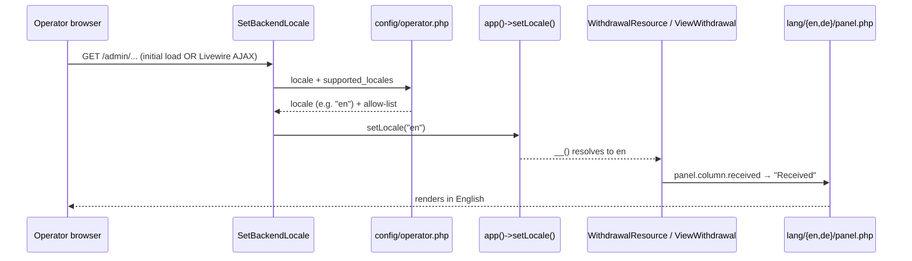

# Slice 007 — Backend i18n (operator panel localization)

> Completed: 2026-06-17
> Commits: 0cdbfc6..4250222 (branch slice-007-backend-i18n, built in the main
> checkout without a worktree per operator request; 4 commits) merged into main via
> GitHub PR #2 (merge commit e0cf537, --no-ff).

## What

The Filament operator panel is now language-configurable. Before this slice every
admin string was hardcoded English; after it the operator selects the backend
language via `BACKEND_LOCALE` in `.env` (default `en`, German with `de`), and the
whole panel — Filament chrome (search, pagination, empty-state, actions) **and**
all custom resource strings (column headers, filter labels, action buttons,
infolist sections/fields) — renders in that language. The consumer-facing
withdrawal form is unaffected and stays German.

- **`BACKEND_LOCALE`** env (default `en`) → `config/operator.php` (`locale` +
  `supported_locales` allow-list `['en','de']`) + `.env.example` placeholder.
- **`SetBackendLocale` middleware** — validates the configured locale against the
  allow-list (fallback `en`), calls `app()->setLocale()`; registered on the admin
  panel with `isPersistent: true` so it runs on Livewire AJAX too.
- **Translation keys** — `WithdrawalResource` + `ViewWithdrawal` strings moved to
  `__('panel.*')`; `lang/en/panel.php` (complete source of truth) + `lang/de/panel.php`
  ("Widerruf" terminology).
- **Filament chrome** — Filament v5 ships German translations natively; setting the
  locale is sufficient (no `vendor:publish`).
- 13 i18n tests (HTTP + a `SetBackendLocale` unit test); 52 tests total green.

## Why

Two product decisions drove it. (1) The backend locale is **decoupled from the
consumer locale** — the OSS operator UI defaults to English, the end-user form is
German at launch; the two audiences are independent and independently controllable.
(2) The middleware must be **persistent** (`isPersistent: true`) — without it the
locale applies only to the initial page load and silently reverts on every Livewire
AJAX call, breaking the language mid-session. A third constraint — `lang/en/panel.php`
must be **complete** — follows from `APP_FALLBACK_LOCALE=de`: any missing English
key would fall back to German and leak into the English panel.

## Decisions

- **Backend locale decoupled from the consumer locale.** Dedicated `BACKEND_LOCALE`
  (default `en`) via a panel-scoped middleware; consumer form stays on global
  `APP_LOCALE=de`. → **promoted to `intent.md`** (Architectural Decisions).
- **Persistent locale middleware (`isPersistent: true`).** Verified against the
  Filament v5 panel-configuration docs; required for the locale to survive Livewire
  AJAX (filter/search/pagination).
- **English is the source-of-truth locale; `en` keys must be complete** — because
  `APP_FALLBACK_LOCALE=de`, any missing `en` key leaks German into the English
  backend. en/de key parity verified (36/36).
- **German terminology = "Widerruf"** (§ 356a term), aligned with the existing
  consumer-facing `lang/de/*` — never "Widerspruch".
- **Locale allow-list (`en`, `de`)** validated in the middleware (fallback `en`),
  guarding against a mistyped env value. The middleware's `config()` fallback was
  later reduced to `[DEFAULT_LOCALE]` so `config/operator.php` is the single source
  of the supported list.
- **Scope = operator panel UI only** — console/CLI output (`app:operator`) stays
  English; the operator command is reworked in slice-008.

## Commits

- `0cdbfc6` — feat(i18n): backend locale for operator panel (config, middleware, lang keys, tests)
- `036f40a` — refactor(i18n): extract DEFAULT_LOCALE constant in SetBackendLocale
- `f8a5dd9` — test(i18n): exercise SetBackendLocale middleware (en/de/fr-fallback) + view-action labels
- `4250222` — refactor(i18n): drop duplicated 'de' from the middleware fallback (config = single source)
- `e0cf537` — Merge pull request #2 → main

Gate at close: Pint (60 files) · PHPStan max (no errors) · Pest (52 passed / 161 assertions).

## Review (Phase 8)

Round 1 surfaced a Heavy/Rethink finding: the test suite bypassed the middleware by
calling `app()->setLocale()` directly, proving nothing about the actual trigger →
effect chain (the middleware could be deleted and every test would still pass).
Resolved by restructuring the suite to exercise the middleware for real — HTTP
requests through the panel stack plus a `tests/Unit/SetBackendLocaleTest.php`
covering `en`→`en`, `de`→`de`, and `fr`→`en` fallback. Re-review: H0 / L2 (both
deferred, no blockers).

## Follow-ups

> Deferred / awareness findings.

- **Livewire persistence tests** assert only `de` strings (phpunit's default
  `APP_LOCALE=de` means the Livewire helper bypass does not weaken the assertion) —
  honest limitation noted in the test file; no action needed.
- **Infolist section/field labels** (`panel.infolist.*`) are not HTTP-asserted (the
  action labels are; key parity is verified). Optional future hardening only.
- **slice-008 (operator rework):** the operator console command and its output stay
  English — i18n of CLI output is out of scope here.

## How (Diagram)

