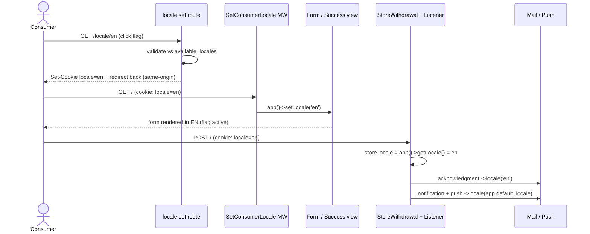

# Slice 009 — i18n Language Switcher

> Completed: 2026-06-27
> Commits: 171d2c3..63f4c9a (PR #5)

## What

The consumer withdrawal form can now be switched between German and English via two
flag icons. The choice (a cookie) governs the whole flow — form, success page, the
stored `Withdrawal.locale`, and the § 356a acknowledgment e-mail — and persists across
GET → POST → success. Before this slice the consumer side was German-only; English
existed only for the operator panel (slice-007).

## Why

- Roadmap Phase 7 (i18n expansion): ship a real second consumer language plus an
  in-form switcher.
- Reuse over invention: the selection mirrors the `SetBackendLocale` /
  `operator.supported_locales` pattern from slice-007 (cookie + middleware + env list),
  rather than a new mechanism.
- Keep operator-facing output stable: a consumer's language choice must not change what
  the single operator receives.

## Decisions

- **Consumer-facing scope only** — the switcher translates the form and the § 356a
  acknowledgment (`lang/en/wf.php` + the `ack` subtree of `lang/en/mail.php`). The
  merchant notification and ntfy push stay operator-language. *Why not* also localize
  the operator channels: they go to one operator and must not follow a consumer's choice.
- **Cookie + `SetConsumerLocale` middleware** — chosen over session / query-param /
  path-prefix. *Why not* those: a cookie survives GET → POST → success so the stored
  locale and the acknowledgment follow the choice, and it reuses the slice-007 pattern.
- **Env-driven locale list** (`APP_AVAILABLE_LOCALES`), mirroring
  `operator.supported_locales`. *Why not* auto-detect from `lang/` dirs: that would expose
  the panel-only `en` as a half-translated consumer option.
- **Locale cookie excluded from encryption** — non-sensitive preference, always
  validated against the available-locales allow-list. *Why not* encrypt: no security
  gain, costs a decrypt per request, and keeps the value opaque.
- **Flag-icon switcher** (Phase-5 UX feedback) — flag SVG per-locale partials under
  `resources/views/components/flags/`, accessible via `aria-label`/`title`/`aria-current`,
  link-based (no JS). *Why not* text pills: the operator asked to match the prototype.
- **Operator output pinned to the frozen default locale** — promoted to `rules.md`
  (Code Conventions). `app()->setLocale()` rewrites `config('app.locale')`, so operator
  channels pin to the new immutable `config('app.default_locale')`. (A Phase-8 Heavy bug
  surfaced because the first attempt pinned to the mutable `config('app.locale')`.)

## Commits

- `171d2c3` — feat(i18n): resolve consumer form locale from a cookie
- `fd68689` — feat(i18n): flag language switcher and English form copy
- `8e845b9` — feat(i18n): English acknowledgment e-mail; pin operator channels
- `63f4c9a` — test(i18n): end-to-end language switcher feature tests

## Follow-ups

- The English acknowledgment keeps the German-style `d.m.Y, H:i` date format and drops
  the "Uhr" suffix; full per-locale date formatting (a `mail.datetime_format` key) was
  left out of scope — candidate for a future i18n slice.

## How (Diagram)

