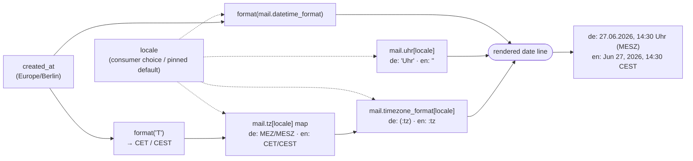

# Slice 010 — Per-Locale, DST-Aware Mail Date & Timezone

> Completed: 2026-06-30
> Commits: 310e269..c04c142 (folded into PR #5, the slice-009 PR)

## What

The § 356a acknowledgment e-mail and the operator notification now render the
receipt timestamp **per locale and DST-aware**. Previously the English mail
inherited the German numeric date and both mails showed the raw IANA label
`Europe/Berlin`. Now an English consumer sees `Jun 27, 2026, 14:30 CEST`, a German
reader `27.06.2026, 14:30 Uhr (MESZ)`, and the abbreviation switches to CET/MEZ in
winter automatically. This closes the slice-009 follow-up and Roadmap Phase 7.

## Why

- Close the slice-009 follow-up / Roadmap Phase 7: the English mail still carried
  German date formatting and an IANA timezone identifier.
- Unambiguity of the legal § 356a receipt: an English-24h clock plus a DST-correct,
  human-readable timezone abbreviation leaves no doubt about the exact instant.

## Decisions

- **English date format `M j, Y, H:i` (24-hour)** — `Jun 27, 2026, 14:30`. *Why not*
  12-hour AM/PM: for a legal receipt the 24-hour clock is inherently unambiguous (no
  AM/PM omission risk) and the amtlich/European-English convention.
- **Timezone shown as a DST-aware abbreviation via PHP's `T` token** — en `CET/CEST`,
  de `MEZ/MESZ`; derived from the timestamp so it tracks daylight saving and
  self-corrects should the EU ever abolish DST (verified the EU still switches in
  2026). *Why not* a hardcoded label or the IANA id: a hardcoded label can't track
  summer/winter, and `Europe/Berlin`, though unambiguous, is a machine identifier.
- **German `MEZ/MESZ` via a data-driven `mail.tz` map** plus a per-locale
  `mail.timezone_format` (de `(:tz)`, en `:tz`). *Why not* PHP's `T` directly for
  German: `T` only emits the language-neutral `CET/CEST`; the German forms are not in
  the tz database.
- **Operator notification now shows the timezone too, de-pinned** (`… Uhr (MEZ/MESZ)`)
  — it previously showed none. *Why not* follow the consumer locale: operator output
  must never follow a consumer's language choice (slice-009 operator-pinning rule).
- **Shared `received-at` Blade partial** (Phase 7 refactor) for the timestamp line,
  included by both mails, with the zone abbreviation in a named `$tz` and a guard
  against leaking a raw translation key. *Why not* a model accessor: presentation
  logic must not live in the domain model.
- **Scope boundary** — this slice closes Phase 7; the stale `Status: planned` markers
  on Roadmap Phases 1–6 are a separate pre-existing doc-drift, not reconciled here.

## Commits

- `310e269` — feat(i18n): per-locale, DST-aware date and timezone in withdrawal mails
- `c04c142` — docs(roadmap): mark Phase 7 (i18n expansion) done

## Follow-ups

- Roadmap Phases 1–6 still carry `Status: planned` although built — a doc-hygiene
  pass should reconcile them (deliberately out of scope here).
- Per-locale month-name handling: `format()` is sufficient for the two shipped
  locales (de numeric, en English abbreviations). A future locale needing localized
  month names would require Carbon's `translatedFormat()`.

## How (Diagram)

